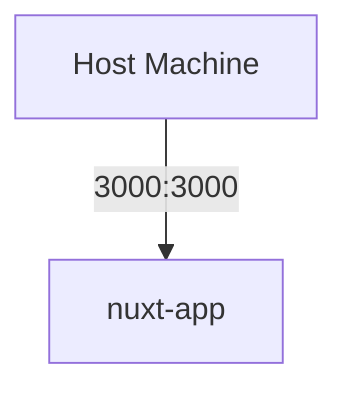
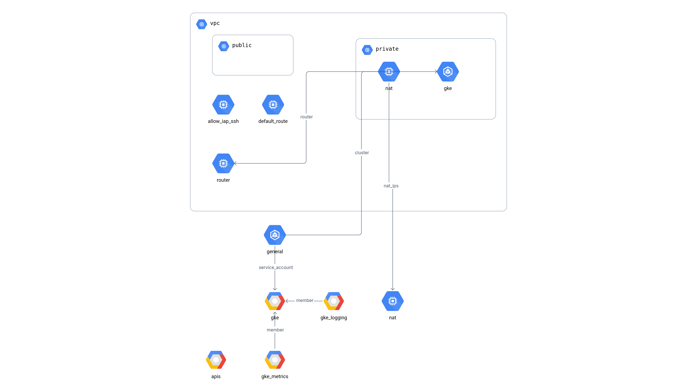
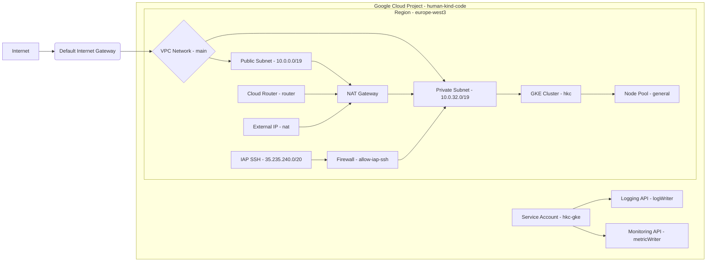
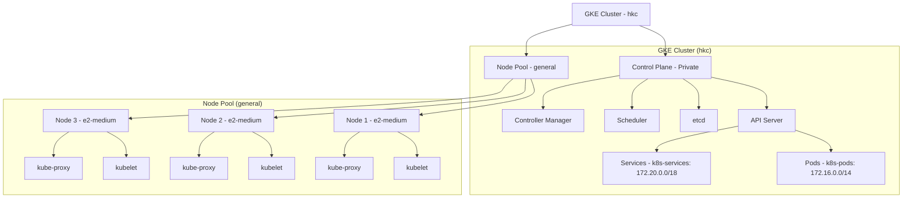

# Human Kind Code Project

## GCP and Terraform

Configure GCP project (the project is there and stays there) and Kubernetes cluster using Terraform:

```bash
terraform init
terraform apply
```

Shut down service on GCP project to save cost using Terraform:

```bash
terraform destroy
```

## Docker

### Build and Push image to GCR (Google Container Registry)

```bash
# Authenticate with GCP
gcloud auth configure-docker

# Build the Docker image
docker build -t gcr.io/human-kind-code/hkc-nuxt-app:latest .

# Push the Docker image to GCR
docker push gcr.io/human-kind-code/hkc-nuxt-app:latest
```

- `docker build`: Build image from Dockerfile
- `-t gcr.io/<your-project-id>/nuxt-app:latest`: Assign a tag to the image
- `push gcr.io/<your-project-id>/nuxt-app:latest`: Push docker image to GCR (Google Container Registry)

### Run Docker Container locally

Run docker container:

```bash
docker run -d -p 3000:3000 gcr.io/human-kind-code/hkc-nuxt-app:latest
```

- `docker run`: Start a container from image
- `-d`: Run container in background
- `-p 3000:3000`: Map port 3000 of host to port 3000 of container
- `<image_name>`: Name of the image

### Docker Compose

Build and run docker container using docker-compose:

```bash
docker-compose up -d
```

- `docker-compose up`: Build and run container from docker-compose.yml
- `-d`: Run container in background

## K8s

```bash
# Authenticate with GKE cluster
gcloud container clusters get-credentials hkc --region europe-west3 --project human-kind-code

# Check if the nodes are ready
kubectl get nodes

# Apply the Kubernetes configuration
kubectl apply -f ./k8s-deployment.yaml
```

- `gcloud container clusters get-credentials <your-cluster-name> --region <your-region>`: Authenticate with GKE cluster

## System Architecture / Design



<!-- TODO start - temporary from https://app.brainboard.co/ -->

### Google Cloud Platform and Kubernetes

brainboard generates images from terraform config - I think it's free to use if I don't use it to deploy anything from it. Lets see if things still work after the trial.



<!-- TODO temporary from Gemini -->



#### Detailed Explanation

Project and Region:

The configuration targets the Google Cloud project "human-kind-code" in the "europe-west3" region.
It enables several essential Google Cloud APIs: Compute Engine, Kubernetes Engine (GKE), Logging, and Secret Manager.
VPC Network (main):

A regional VPC network named "main" is created.
auto_create_subnetworks is disabled, and delete_default_routes_on_create is enabled, ensuring a clean and controlled network setup.
A default route is created directing all traffic to the default internet gateway.
Subnetworks:

Public Subnet (10.0.0.0/19):
This subnet is intended for resources that require direct internet access.
private_ip_google_access is enabled.
Private Subnet (10.0.32.0/19):
This subnet is for resources that should not be directly exposed to the internet, such as GKE nodes.
private_ip_google_access is enabled.
Secondary IP ranges are defined for GKE pods (172.16.0.0/14) and services (172.20.0.0/18).
NAT Gateway:

An external IP address ("nat") is reserved.
A Cloud Router ("router") and a Cloud NAT gateway ("nat") are configured to allow resources in the private subnet to access the internet.
The NAT gateway uses the reserved external IP address.
The NAT is configured to allow all ip ranges within the private subnet to use the NAT.
Firewall Rule (allow-iap-ssh):

A firewall rule is created to allow SSH access to instances in the private subnet via Identity-Aware Proxy (IAP).
The source range "35.235.240.0/20" is used, which is the IAP range.
GKE Cluster (hkc):

A private GKE cluster named "hkc" is created in the "europe-west3" region.
It uses VPC-native networking and is placed in the private subnet.
The cluster is configured with private nodes and a private master endpoint.
The cluster uses the defined secondary IP ranges for pods and services.
Autoscaling is enabled for Horizontal Pod Autoscaling.
Deletion protection is disabled.
The cluster uses the REGULAR release channel.
Service Account (hkc-gke):

A service account named "hkc-gke" is created.
This service account is granted the "roles/logging.logWriter" and "roles/monitoring.metricWriter" roles, allowing GKE nodes to write logs and metrics.
Node Pool (general):

A node pool named "general" is created within the GKE cluster.
It uses "e2-medium" machine types.
Autoscaling is enabled with a minimum of 1 and a maximum of 3 nodes.
Auto-repair and auto-upgrade are enabled.
The nodes use the "hkc-gke" service account with the "cloud-platform" OAuth scope.
Key Takeaways:

The architecture emphasizes security by using a private GKE cluster and a private subnet.
Cloud NAT enables internet access for private resources.
IAP is used for secure SSH access.
The system is designed to be scalable using GKE node pool autoscaling.
Logging and monitoring are enabled through IAM roles.

#### K8S cluster



<!-- TODO end-->
